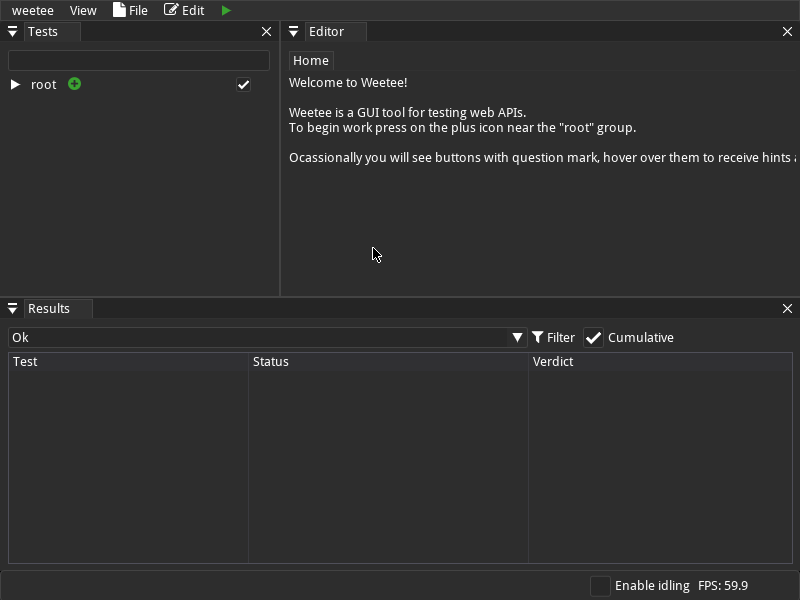

# Web API Testing app
Name of the app comes from the 2 letters W and T in the short title description.

## Installation
```
$ git clone https://github.com/rndm13/weetee 
$ cd weetee
$ mkdir build
$ cd build
$ cmake ..
$ cmake --build .
```

## Quick Start

Weetee app consists of 3 main windows:
- Test Structure View (on the left side of the screen)
- Test Editor (in the center, initially opens a homepage)
- Testing Results View (on the bottom side of the screen)

### Test Suite Structure



Initially your test suite will have only a single root group and no tests. To change it click on the green plus icon near the root group.
You can also open a context menu with a right click on the group and select "Add New Test" option.


After doing that a new tab in the editor window will open for the newly added test.

### Editor


While there are a lot of fields in this window the most important ones are the endpoint, the type of HTTP request and the request details.

The request details are split into 4 tabs:
- Body (hidden for GET requests)
- Parameters
- Cookies
- Headers

Body can be switched from a simple text editor to a multipart body table editor.


Weetee allows you to specify the expected response as well for automatic testing in the Response tabs.
This includes HTTP status, where you can also use character `x` or `X` as a wildcard.

### Testing

To begin testing with newly created test suite press the green arrow button in the top bar menu.
It is also possible to begin testing only for selected tests with the "Run tests" option in context menu.


Testing window will get instantly populated with future results with available progress information.


You can double click any of the results to view its exact sent request and received response.


This should get you started with basic usage of weetee.

## Credits
- [imgui_bundle](https://github.com/pthom/imgui_bundle) 
- [cpp-httplib](https://github.com/yhirose/cpp-httplib) 
- [nlohmann/json](https://github.com/nlohmann/json)
- [cotire](https://github.com/sakra/cotire)
